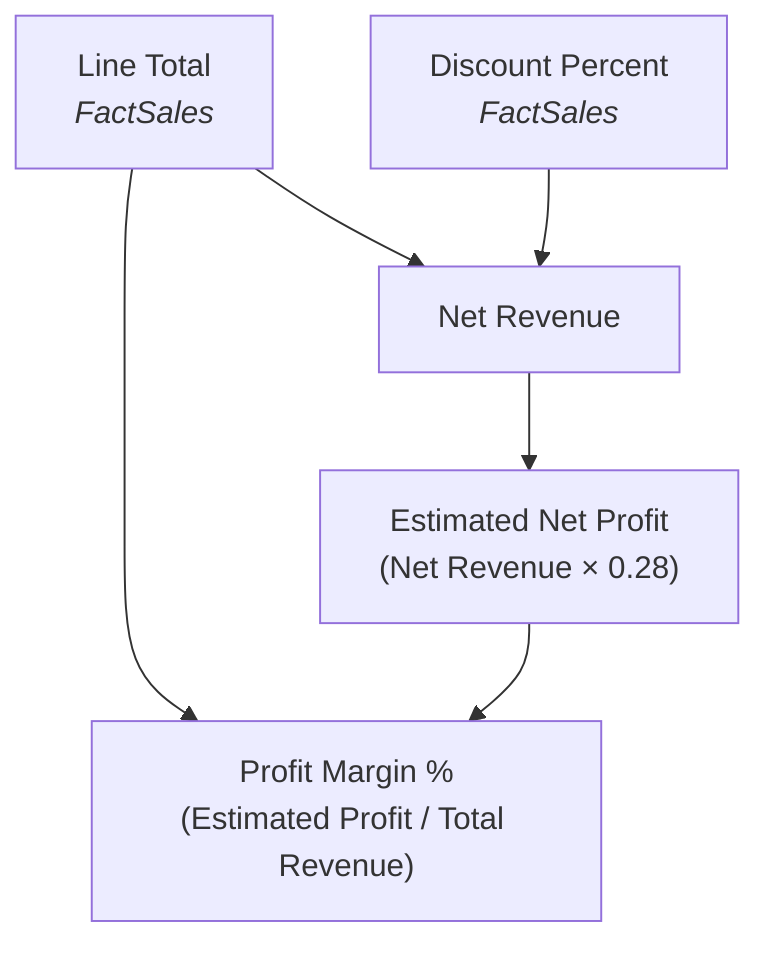
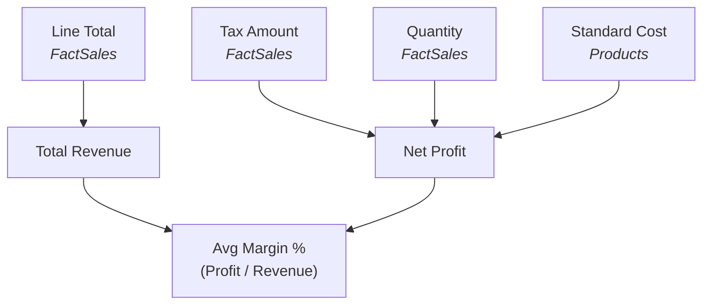
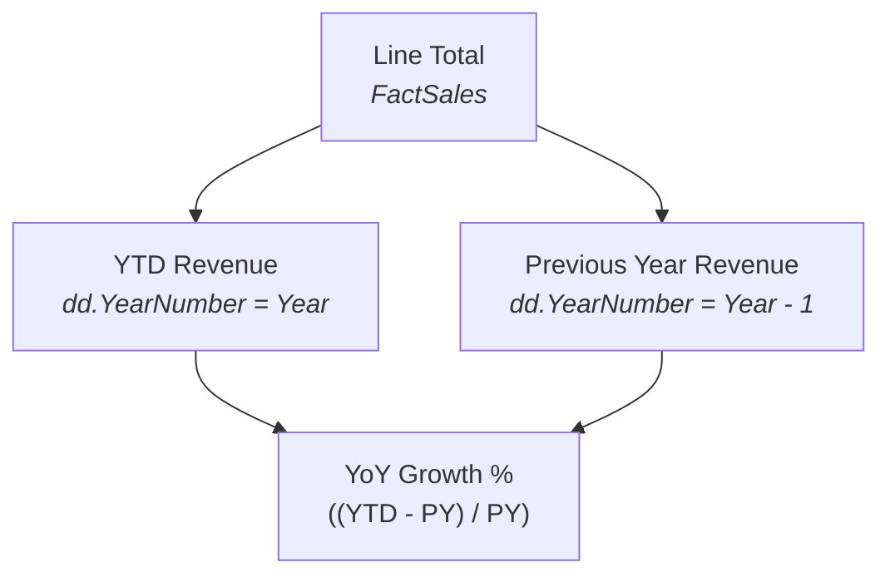
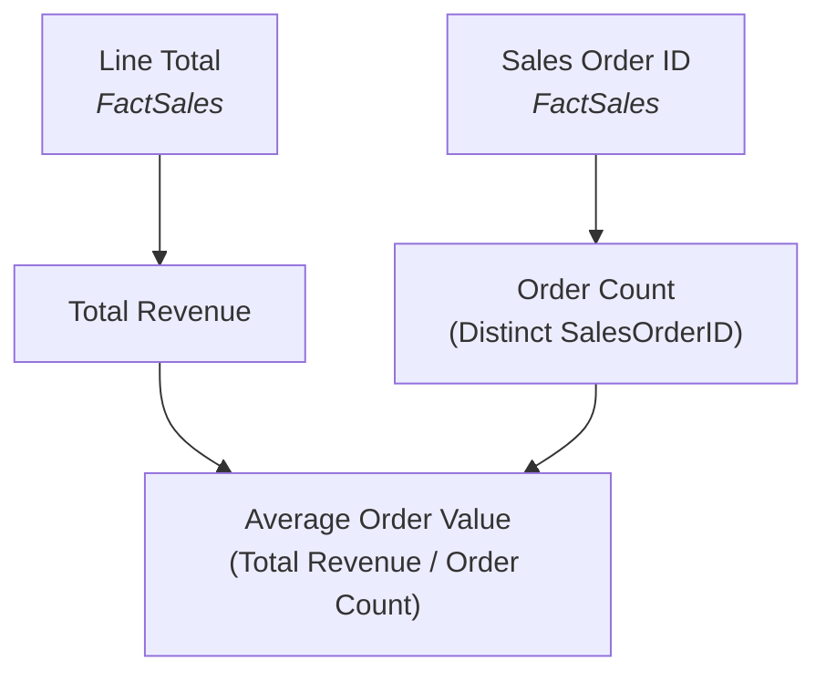

# SalesCube OLAP — BI Formulas Reference Manual
**Document Reference**: BI-FORMULAS-2026-V1  
**Author**: Senior BI Architect & Systems Engineer  
**Status**: Verified & Audited  
**Date**: June 4, 2026

---

## 1. Dashboard Formula Inventory

This inventory maps every visible KPI, metric card, and visualization widget to its code-level calculation and source files.

### 1.1 Executive Overview
Sourced dynamically from `/api/kpis` (core cards), `/api/kpis-advanced` (advanced section), and `/api/sales-by-date` (trend analysis).

| Component / Widget | Formula / Computation Found | File Location | API Endpoint |
| :--- | :--- | :--- | :--- |
| **Total Revenue Card** | `displayKpis.totalRevenue` (renders live `totalSales` or static `totalRevenue`) | [ExecutiveOverview.tsx](file:///f:/C/me/GLID2%20Projet/Datawarehouse/BI/src/components/ExecutiveOverview.tsx#L194-L213) | `/api/kpis` |
| **Units Sold Card** | `displayKpis.totalUnits` (renders live `totalQuantity` or static `totalUnits`) | [ExecutiveOverview.tsx](file:///f:/C/me/GLID2%20Projet/Datawarehouse/BI/src/components/ExecutiveOverview.tsx#L216-L235) | `/api/kpis` |
| **Total Tax Card** | `displayKpis.totalTax` (renders live `totalTax` or static `totalTax`) | [ExecutiveOverview.tsx](file:///f:/C/me/GLID2%20Projet/Datawarehouse/BI/src/components/ExecutiveOverview.tsx#L238-L261) | `/api/kpis` |
| **Total Orders Card** | `displayKpis.totalOrders` (renders live `totalOrders` or static `orderCount`) | [ExecutiveOverview.tsx](file:///f:/C/me/GLID2%20Projet/Datawarehouse/BI/src/components/ExecutiveOverview.tsx#L264-L285) | `/api/kpis` |
| **OLAP Synthesis Summary** | `data.summary` string concatenation linking brand percentages and rep performance | [ExecutiveOlapInsights.tsx](file:///f:/C/me/GLID2%20Projet/Datawarehouse/BI/src/components/ExecutiveOlapInsights.tsx#L327-L330) | Direct / Frontend |
| **Revenue Leader Brand** | Grouping and sorting brand slices to find maximum contribution: `(BrandRevenue / TotalRevenue) * 100` | [ExecutiveOlapInsights.tsx](file:///f:/C/me/GLID2%20Projet/Datawarehouse/BI/src/components/ExecutiveOlapInsights.tsx#L162-L177) | `/api/sales-by-brand` |
| **Top Sales Rep Card** | Leaderboard sorting to extract best performer revenue and average profit margin % | [ExecutiveOlapInsights.tsx](file:///f:/C/me/GLID2%20Projet/Datawarehouse/BI/src/components/ExecutiveOlapInsights.tsx#L179-L210) | `/api/sales-by-employee` |
| **Best Selling Product** | Product sales sorting to extract highest revenue product name and volume sold | [ExecutiveOlapInsights.tsx](file:///f:/C/me/GLID2%20Projet/Datawarehouse/BI/src/components/ExecutiveOlapInsights.tsx#L212-L233) | `/api/sales-by-product` |
| **Strongest Quarter Card**| Time-series aggregation to find the peak calendar quarter and its QoQ growth % | [ExecutiveOlapInsights.tsx](file:///f:/C/me/GLID2%20Projet/Datawarehouse/BI/src/components/ExecutiveOlapInsights.tsx#L235-L266) | `/api/sales-by-date` |
| **Market Distribution** | Computes active dimension slices: distinct Brand count, Product count, and Employee count | [ExecutiveOlapInsights.tsx](file:///f:/C/me/GLID2%20Projet/Datawarehouse/BI/src/components/ExecutiveOlapInsights.tsx#L268-L281) | Multi-endpoint |
| **Discount Elasticity** | Dynamic analysis parsing discount rate with highest revenue vs. rate with highest profit margins | [ExecutiveOlapInsights.tsx](file:///f:/C/me/GLID2%20Projet/Datawarehouse/BI/src/components/ExecutiveOlapInsights.tsx#L283-L321) | `/api/sales-by-discount-rate` |
| **Sales Trend Chart** | Area chart mapping `revenue` (`lineTotal`), `profit` (`profit`), and `volume` (`volume`) over time | [ExecutiveOverview.tsx](file:///f:/C/me/GLID2%20Projet/Datawarehouse/BI/src/components/ExecutiveOverview.tsx#L332-L412) | `/api/sales-by-date` |

---

### 1.2 Sales Performance
Sourced dynamically from `/api/sales-by-brand`, `/api/sales-by-product`, and `/api/sales-by-geography`.

| Component / Widget | Formula / Computation Found | File Location | API Endpoint |
| :--- | :--- | :--- | :--- |
| **Sales by Brand Chart** | Horizontal bar chart mapping brand `revenue` (`lineTotal`) and `volume` (`quantity`) | [SalesPerformance.tsx](file:///f:/C/me/GLID2%20Projet/Datawarehouse/BI/src/components/SalesPerformance.tsx#L168-L201) | `/api/sales-by-brand` |
| **Top Products Chart** | Donut chart plotting top 8 products by revenue | [SalesPerformance.tsx](file:///f:/C/me/GLID2%20Projet/Datawarehouse/BI/src/components/SalesPerformance.tsx#L225-L257) | `/api/sales-by-product` |
| **Revenue by Country** | Vertical bar chart plotting regional revenue distribution | [SalesPerformance.tsx](file:///f:/C/me/GLID2%20Projet/Datawarehouse/BI/src/components/SalesPerformance.tsx#L278-L310) | `/api/sales-by-geography` |

---

### 1.3 Rep Leaderboard
Sourced dynamically from `/api/sales-by-employee`.

| Component / Widget | Formula / Computation Found | File Location | API Endpoint |
| :--- | :--- | :--- | :--- |
| **Standings Bar Chart** | Bar chart plotting `revenue` (`lineTotal`) and `profit` (`profit`) per salesperson | [EmployeeLeaderboard.tsx](file:///f:/C/me/GLID2%20Projet/Datawarehouse/BI/src/components/EmployeeLeaderboard.tsx#L198-L236) | `/api/sales-by-employee` |
| **Detailed Ranking Table**| Renders tabular rankings with `revenue`, `profit`, `quantity`, and calculated `marginPercent` | [EmployeeLeaderboard.tsx](file:///f:/C/me/GLID2%20Projet/Datawarehouse/BI/src/components/EmployeeLeaderboard.tsx#L276-L320) | `/api/sales-by-employee` |

---

### 1.4 Promotions Deep-Dive
Sourced dynamically from `/api/sales-by-promotion` and `/api/sales-by-discount-rate`.

| Component / Widget | Formula / Computation Found | File Location | API Endpoint |
| :--- | :--- | :--- | :--- |
| **Promotions Bar Chart** | Bar chart mapping campaign `revenue` (`lineTotal`), `volume` (`quantity`), and calculated `avgDiscountPercent` | [PromotionsDeepDive.tsx](file:///f:/C/me/GLID2%20Projet/Datawarehouse/BI/src/components/PromotionsDeepDive.tsx#L255-L294) | `/api/sales-by-promotion` |
| **Discount Elasticity Chart**| Composed dual-axis chart mapping transaction `volume` (Units) against `marginPercent` (%) | [PromotionsDeepDive.tsx](file:///f:/C/me/GLID2%20Projet/Datawarehouse/BI/src/components/PromotionsDeepDive.tsx#L323-L391) | `/api/sales-by-discount-rate` |

---

## 2. Formula Extraction

This section documents every metric calculation extracted directly from the codebase.

### 2.1 Net Revenue
* **Business Purpose**: Computes the final transaction amount after deducting discounts. Used in YTD/QTD advanced calculations.
* **Formula**:
  $$\text{Net Revenue} = \sum (\text{LineTotal} \times (1 - \text{DiscountPercent}))$$
  ```typescript
  // Sourced from /api/kpis-advanced/route.ts (Line 40)
  SUM(fs.LineTotal * (1 - fs.DiscountPercent)) AS netRevenue
  ```
* **Source**: SQL Aggregation
* **File Path**: [route.ts](file:///f:/C/me/GLID2%20Projet/Datawarehouse/BI/src/app/api/kpis-advanced/route.ts#L40)
* **API Route**: `/api/kpis-advanced`
* **Verification Status**: Verified (Active)

---

### 2.2 Transaction Profit
* **Business Purpose**: Computes real profit by subtracting tax amounts and product standard costs from transactional line totals. Standard cost is joined from the relational product catalog.
* **Formula**:
  $$\text{Profit} = \sum (\text{LineTotal} - \text{TaxAmount} - (\text{Quantity} \times \text{StandardCost}))$$
  ```typescript
  // Sourced from /api/sales-by-date/route.ts (Line 50)
  SUM(fs.LineTotal - fs.TaxAmount - (fs.Quantity * p.StandardCost)) AS profit
  ```
* **Source**: SQL Aggregation (Joined relational database tables)
* **File Path**: [route.ts](file:///f:/C/me/GLID2%20Projet/Datawarehouse/BI/src/app/api/sales-by-date/route.ts#L50)
* **API Route**: `/api/sales-by-date`, `/api/sales-by-employee`, `/api/sales-by-discount-rate`
* **Verification Status**: Verified (Active)

---

### 2.3 Estimated Net Profit (KPI)
* **Business Purpose**: Evaluates a high-level net profit approximation for executive tracking based on an assumed 28% margin model of the year-to-date net revenue.
* **Formula**:
  $$\text{Estimated Profit} = \text{Net Revenue} \times 0.28$$
  ```typescript
  // Sourced from /api/kpis-advanced/route.ts (Line 99)
  const estimatedProfit = netRevenue * 0.28;
  ```
* **Source**: Backend Calculation
* **File Path**: [route.ts](file:///f:/C/me/GLID2%20Projet/Datawarehouse/BI/src/app/api/kpis-advanced/route.ts#L99)
* **API Route**: `/api/kpis-advanced`
* **Verification Status**: Verified (Active)

---

### 2.4 Profit Margin Percentage
* **Business Purpose**: Calculates the percentage ratio of estimated profit relative to the total YTD invoiced revenue.
* **Formula**:
  $$\text{Profit Margin \%} = \frac{\text{Estimated Profit}}{\text{Total YTD Revenue}} \times 100$$
  ```typescript
  // Sourced from /api/kpis-advanced/route.ts (Line 112)
  profitMarginPct: Math.round((estimatedProfit / (ytdRevenue || 1)) * 10000) / 100
  ```
* **Source**: Backend Calculation
* **File Path**: [route.ts](file:///f:/C/me/GLID2%20Projet/Datawarehouse/BI/src/app/api/kpis-advanced/route.ts#L112)
* **API Route**: `/api/kpis-advanced`
* **Verification Status**: Verified (Active)

---

### 2.5 YoY Revenue Growth Rate
* **Business Purpose**: Evaluates the Year-over-Year growth percentage of the current year-to-date sales compared to the prior calendar year baseline.
* **Formula**:
  $$\text{YoY Growth} = \frac{\text{YTD Revenue} - \text{Previous Year Revenue}}{\text{Previous Year Revenue}} \times 100$$
  ```typescript
  // Sourced from /api/kpis-advanced/route.ts (Lines 97, 107)
  const growth = previousYearRevenue > 0 ? (ytdRevenue - previousYearRevenue) / previousYearRevenue : 0;
  // rounded to 2 decimal places:
  revenueGrowthPct: Math.round(growth * 10000) / 100
  ```
* **Source**: Backend Calculation
* **File Path**: [route.ts](file:///f:/C/me/GLID2%20Projet/Datawarehouse/BI/src/app/api/kpis-advanced/route.ts#L97)
* **API Route**: `/api/kpis-advanced`
* **Verification Status**: Verified (Active)

---

### 2.6 Average Order Value (AOV)
* **Business Purpose**: Sourced directly as the arithmetic mean of all transactional order line values for the current year.
* **Formula**:
  $$\text{AOV} = \text{AVG}(\text{LineTotal})$$
  ```typescript
  // Sourced from /api/kpis-advanced/route.ts (Lines 44, 109)
  AVG(fs.LineTotal) AS avgOrderValue
  // rounded to 2 decimal places:
  avgOrderValue: Math.round(Number(ytd?.avgOrderValue ?? 0) * 100) / 100
  ```
* **Source**: SQL Aggregation
* **File Path**: [route.ts](file:///f:/C/me/GLID2%20Projet/Datawarehouse/BI/src/app/api/kpis-advanced/route.ts#L44)
* **API Route**: `/api/kpis-advanced`
* **Verification Status**: Verified (Active)

---

### 2.7 Average Campaign Discount Percentage
* **Business Purpose**: Computes the average promotional discount percentage applied to campaign sales, calculated relative to gross sales (LineTotal + DiscountAmount).
* **Formula**:
  $$\text{Avg Discount \%} = \frac{\text{Discount Amount}}{\text{Line Total} + \text{Discount Amount}} \times 100$$
  ```typescript
  // Sourced from /api/sales-by-promotion/route.ts (Line 69)
  const avgDiscountPercent =
    lineTotal + discountAmount > 0
      ? Math.round((discountAmount / (lineTotal + discountAmount)) * 10000) / 100
      : 0;
  ```
* **Source**: Backend Calculation
* **File Path**: [route.ts](file:///f:/C/me/GLID2%20Projet/Datawarehouse/BI/src/app/api/sales-by-promotion/route.ts#L69)
* **API Route**: `/api/sales-by-promotion`
* **Verification Status**: Verified (Active)

---

### 2.8 Segment Profit Margin (Discount Sensitivity)
* **Business Purpose**: Computes the net profit margin achieved within a specific discount rate bucket (e.g. 5% or 10%).
* **Formula**:
  $$\text{Segment Margin \%} = \frac{\text{Segment Profit}}{\text{Segment Revenue}} \times 100$$
  ```typescript
  // Sourced from /api/sales-by-discount-rate/route.ts (Line 47)
  marginPercent: revenue > 0 ? Math.round((profit / revenue) * 1000) / 10 : 0
  ```
* **Source**: Backend Calculation (derived from SQL queries)
* **File Path**: [route.ts](file:///f:/C/me/GLID2%20Projet/Datawarehouse/BI/src/app/api/sales-by-discount-rate/route.ts#L47)
* **API Route**: `/api/sales-by-discount-rate`
* **Verification Status**: Verified (Active)

---

### 2.9 Average Order Line Volume (Units per Order Line)
* **Business Purpose**: Evaluates order velocity by calculating the average units sold per order line at a specific discount tier.
* **Formula**:
  $$\text{Avg Units/Line} = \frac{\text{Total Quantity (Volume)}}{\text{Total Transaction Count}}$$
  ```typescript
  // Sourced from /api/sales-by-discount-rate/route.ts (Line 48)
  avgOrderQuantity: count > 0 ? Math.round((volume / count) * 10) / 10 : 0
  ```
* **Source**: Backend Calculation (derived from SQL queries)
* **File Path**: [route.ts](file:///f:/C/me/GLID2%20Projet/Datawarehouse/BI/src/app/api/sales-by-discount-rate/route.ts#L48)
* **API Route**: `/api/sales-by-discount-rate`
* **Verification Status**: Verified (Active)

---

### 2.10 Sales Representative Profit Margin
* **Business Purpose**: Measures salesperson pricing discipline by calculating their net margin percentage across all closed sales.
* **Formula**:
  $$\text{Rep Profit Margin \%} = \frac{\text{Rep Net Profit}}{\text{Rep Total Revenue}} \times 100$$
  ```typescript
  // Sourced from EmployeeLeaderboard.tsx (Line 89)
  marginPercent: revenue > 0 ? Math.round((profit / revenue) * 100) : 0
  ```
* **Source**: Frontend Calculation (Chart Adapter)
* **File Path**: [EmployeeLeaderboard.tsx](file:///f:/C/me/GLID2%20Projet/Datawarehouse/BI/src/components/EmployeeLeaderboard.tsx#L89)
* **API Route**: `/api/sales-by-employee` (provides `lineTotal` and `profit`)
* **Verification Status**: Verified (Active)

---

### 2.11 Leaderboard Performance Lead Gap
* **Business Purpose**: Calculates the percentage lead that the top-ranked sales representative holds over the runner-up.
* **Formula**:
  $$\text{Lead Gap \%} = \frac{\text{Top Rep Revenue} - \text{Runner-Up Rep Revenue}}{\text{Runner-Up Rep Revenue}} \times 100$$
  ```typescript
  // Sourced from EmployeeLeaderboard.tsx (Lines 112-115)
  const leadAmount = topRep.revenue - (runnerUp ? runnerUp.revenue : 0);
  const leadPct = runnerUp && runnerUp.revenue > 0 
    ? Math.round((leadAmount / runnerUp.revenue) * 100) 
    : 0;
  ```
* **Source**: Frontend Calculation
* **File Path**: [EmployeeLeaderboard.tsx](file:///f:/C/me/GLID2%20Projet/Datawarehouse/BI/src/components/EmployeeLeaderboard.tsx#L112)
* **API Route**: `/api/sales-by-employee`
* **Verification Status**: Verified (Active)

---

### 2.12 Brand Revenue Contribution Share
* **Business Purpose**: Evaluates the revenue share percentage of the top-performing brand relative to total sales.
* **Formula**:
  $$\text{Brand Revenue Share \%} = \frac{\text{Top Brand Sales}}{\text{Total Revenue}} \times 100$$
  ```typescript
  // Sourced from ExecutiveOlapInsights.tsx (Line 167)
  percent: Math.round((top.lineTotal / totalRevenue) * 1000) / 10
  ```
* **Source**: Frontend Calculation (derived from Brand endpoint results)
* **File Path**: [ExecutiveOlapInsights.tsx](file:///f:/C/me/GLID2%20Projet/Datawarehouse/BI/src/components/ExecutiveOlapInsights.tsx#L167)
* **API Route**: `/api/sales-by-brand`
* **Verification Status**: Verified (Active)

---

### 2.13 QoQ Quarterly Revenue Growth
* **Business Purpose**: Evaluates quarterly performance gains compared to the immediately preceding quarter.
* **Formula**:
  $$\text{QoQ Growth \%} = \frac{\text{Current Quarter Revenue} - \text{Previous Quarter Revenue}}{\text{Previous Quarter Revenue}} \times 100$$
  ```typescript
  // Sourced from TimeIntelligence.tsx (Lines 78-80)
  delta: data && data.previousQuarterRevenue > 0
    ? ((data.qtdRevenue - data.previousQuarterRevenue) / data.previousQuarterRevenue) * 100
    : undefined
  ```
* **Source**: Frontend Calculation
* **File Path**: [TimeIntelligence.tsx](file:///f:/C/me/GLID2%20Projet/Datawarehouse/BI/src/components/TimeIntelligence.tsx#L78)
* **API Route**: `/api/kpis-advanced`
* **Verification Status**: Verified (Active)

---

## 3. Formula Dependency Analysis

The downstream calculations in the BI system trace back to three atomic, database-level aggregates: **LineTotal**, **Quantity**, and **DiscountAmount**. The following dependency trees map how secondary metrics are derived.

### 3.1 Financial Margins and Profitability


### 3.2 Leaderboard Pricing Integrity


### 3.3 Time Intelligence Growth Rates


### 3.4 Transaction Volume Efficiency


---

## 4. Hidden Calculations Audit

Many key analytical steps and adapters reside implicitly in data formatting and filtering wrappers.

### 4.1 Recharts Layout Value Conversions
To prevent chart text overlaps, the UI formats vertical tick axis labels dynamically:
- **Currency division**:
  ```typescript
  // Sourced from SalesPerformance.tsx (Line 183)
  tickFormatter={(val) => `$${val / 1000}k`}
  ```
  Reduces label lengths (e.g. `$250,000` is rendered as `$250k`).

### 4.2 Compact Value Formatter
Used for summary badges and advanced metric headers:
```typescript
// Sourced from export.ts (Lines 99-103)
export function formatCompact(value: number): string {
  if (value >= 1_000_000) return `${(value / 1_000_000).toFixed(2)}M`;
  if (value >= 1_000) return `${(value / 1_000).toFixed(1)}K`;
  return value.toFixed(0);
}
```
* **Logic**: Divides large raw numbers into formatted abbreviations (`M` for Millions, `K` for Thousands).

### 4.3 Static Estimated Profit margin
In `DashboardContext.tsx`, static database records compute profit using cost fields:
```typescript
// Sourced from DashboardContext.tsx (Lines 174-178)
let netSales = 0;
filteredSales.forEach(r => {
  netSales += (r.LineTotal - r.TaxAmount);
});
const totalProfit = netSales - totalCost;
```
However, in `ExecutiveOverview.tsx`, if the SSAS linked server goes offline and `tsLive` is false:
```typescript
// Sourced from ExecutiveOverview.tsx (Line 106)
profit: Math.round(d.profit ?? (d.lineTotal * 0.35))
```
* **Logic**: If the standard cost data cannot be computed dynamically (due to lack of dimensional standards in flat SSAS records), profit is estimated as a fixed **35%** of the line total.

---

## 5. Chart Audit

Details on data sources, SQL/MDX query definitions, and charts configuration.

### 5.1 Sales Trend Analysis Chart
- **Chart Name**: Sales Trend Analysis (Area Chart)
- **Data Source**: `/api/sales-by-date`
- **Query Source**: 
  - *Live (Filtered)*: SQL query with `INNER JOIN DimDate d` and `INNER JOIN Products p`
  - *Live (Unfiltered)*: T-SQL `OPENQUERY(SSAS_CUBE)` joining `DimDate` and `FactSales`
- **Formula Used**: 
  - Revenue = `SUM(fs.LineTotal)`
  - Volume = `SUM(fs.Quantity)`
  - Profit = `SUM(fs.LineTotal - fs.TaxAmount - (fs.Quantity * p.StandardCost))`
- **Aggregation Used**: `GROUP BY` calendar period (`YearNumber`, `QuarterNumber`, or `MonthNumber`)
- **Filters Applied**: `YearNumber`, `QuarterNumber`, `MonthNumber`, `BrandID`, `OrderStatus` (excludes `'Cancelled'`)
- **File Location**: [ExecutiveOverview.tsx](file:///f:/C/me/GLID2%20Projet/Datawarehouse/BI/src/components/ExecutiveOverview.tsx)

### 5.2 Sales by Brand Chart
- **Chart Name**: Sales by Brand (Horizontal Bar Chart)
- **Data Source**: `/api/sales-by-brand`
- **Query Source**:
  - *Live (Filtered)*: SQL query with `JOIN Brands b`
  - *Live (Unfiltered)*: `OPENQUERY(SSAS_CUBE)` pulling measures per `[Brands].[Brand ID]` joined relational-side.
- **Formula Used**: 
  - Revenue = `SUM(fs.LineTotal)`
  - Quantity = `SUM(fs.Quantity)`
- **Aggregation Used**: `GROUP BY b.BrandName`
- **Filters Applied**: `YearNumber`, `QuarterNumber`, `MonthNumber`, `BrandID`, `OrderStatus` (excludes `'Cancelled'`)
- **File Location**: [SalesPerformance.tsx](file:///f:/C/me/GLID2%20Projet/Datawarehouse/BI/src/components/SalesPerformance.tsx)

### 5.3 Top Products Chart
- **Chart Name**: Top Products by Revenue (Donut Pie Chart)
- **Data Source**: `/api/sales-by-product`
- **Query Source**:
  - *Live (Filtered)*: SQL query with `JOIN Products p`
  - *Live (Unfiltered)*: `OPENQUERY(SSAS_CUBE)` pulling measures per `[Products].[Product ID]` joined relational-side.
- **Formula Used**: `SUM(fs.LineTotal)`
- **Aggregation Used**: `GROUP BY p.ProductName`
- **Filters Applied**: `YearNumber`, `QuarterNumber`, `MonthNumber`, `BrandID`, `OrderStatus` (excludes `'Cancelled'`), limited to top 8 rows (`.slice(0, 8)`)
- **File Location**: [SalesPerformance.tsx](file:///f:/C/me/GLID2%20Projet/Datawarehouse/BI/src/components/SalesPerformance.tsx)

### 5.4 Revenue by Country Chart
- **Chart Name**: Revenue by Region & Country (Vertical Bar Chart)
- **Data Source**: `/api/sales-by-geography?groupBy=country`
- **Query Source**: SQL query joining `Customers c` table.
- **Formula Used**: `SUM(fs.LineTotal)`
- **Aggregation Used**: `GROUP BY c.Country`
- **Filters Applied**: `YearNumber`, `QuarterNumber`, `MonthNumber`, `BrandID`, `OrderStatus` (excludes `'Cancelled'`)
- **File Location**: [SalesPerformance.tsx](file:///f:/C/me/GLID2%20Projet/Datawarehouse/BI/src/components/SalesPerformance.tsx)

### 5.5 Discount Elasticity Chart
- **Chart Name**: Discount Rate Elasticity & Profit Sensitivity (Composed Bar and Line Chart)
- **Data Source**: `/api/sales-by-discount-rate`
- **Query Source**: SQL query joining `Products p` table.
- **Formula Used**:
  - discount = `CAST(ROUND(fs.DiscountPercent * 100, 0) AS INT)`
  - volume = `SUM(fs.Quantity)`
  - revenue = `SUM(fs.LineTotal)`
  - profit = `SUM(fs.LineTotal - fs.TaxAmount - (fs.Quantity * p.StandardCost))`
  - count = `COUNT(fs.SalesOrderID)`
- **Aggregation Used**: `GROUP BY ROUND(fs.DiscountPercent * 100, 0)`
- **Filters Applied**: `YearNumber`, `QuarterNumber`, `MonthNumber`, `BrandID`, `OrderStatus` (excludes `'Cancelled'`)
- **File Location**: [PromotionsDeepDive.tsx](file:///f:/C/me/GLID2%20Projet/Datawarehouse/BI/src/components/PromotionsDeepDive.tsx)

---

## 6. Ranking and Sorting Audit

The ranking system is implemented on the sales representative leaderboard.

- **Ranking Field**: Total Sales Revenue (`lineTotal` / `revenue`)
- **Sort Order**: Descending order (`DESC` / `.sort((a, b) => b.revenue - a.revenue)`)
- **Tie-Breaking Logic**: Implicitly handled by the SQL engine sorting order or JS engine. If two reps generate identical sales revenues, the sorting defaults to the database row scan sequence.
- **Scoring and Indexing**: Indexes are converted to rank values in the table mapping using:
  ```typescript
  // Sourced from EmployeeLeaderboard.tsx (Line 294)
  <RankBadge rank={index + 1} />
  ```

---

## 7. Performance and Catalog Aggregation Audit

Detailed mapping of the SQL-layer commercial performance and catalog distribution aggregates:

### 7.1 Average Order Value (AOV)
Calculates the mean revenue value generated per unique customer sales transaction.
- **T-SQL implementation**:
  ```sql
  -- Computed from /api/kpis
  SELECT SUM(fs.LineTotal) / COUNT(DISTINCT fs.SalesOrderID) AS avgOrderValue
  FROM FactSales fs
  ```

### 7.2 Profit Margin %
Calculates the dynamic percentage ratio of total product-level transaction profit (revenue minus product standard cost and taxes) relative to total net sales.
- **T-SQL implementation**:
  ```sql
  -- Computed from /api/kpis
  SELECT (SUM(fs.LineTotal - fs.TaxAmount - (fs.Quantity * p.StandardCost)) / NULLIF(SUM(fs.LineTotal - fs.TaxAmount), 0)) * 100 AS profitMarginPct
  FROM FactSales fs
  JOIN Products p ON fs.ProductID = p.ProductID
  ```

### 7.3 Active Catalog Brands and Products
Measures catalog saturation by counting unique product identifiers and brand identifiers with registered transactions.
- **T-SQL implementation**:
  ```sql
  -- Computed from /api/kpis
  SELECT 
    COUNT(DISTINCT fs.BrandID) AS activeBrands,
    COUNT(DISTINCT fs.ProductID) AS activeProducts
  FROM FactSales fs
  ```

---

## 8. Data Quality Rules

These guidelines prevent divide-by-zero crashes, handle null columns, and standardize currency rounding.

### 8.1 Zero-Division Protection
To prevent JavaScript runtime crashes when calculating margin ratios or growth trends on empty datasets:
- **Profit Margin Protection**:
  `estimatedProfit / (ytdRevenue || 1)`
- **Growth Percentage Protection**:
  `previousYearRevenue > 0 ? (ytdRevenue - previousYearRevenue) / previousYearRevenue : 0`
- **Frontend Target Attainment Protection**:
  `cfg.target > 0 ? (cfg.value / cfg.target) * 100 : 0`

### 8.2 Rounding Logic
- **Monetary Aggregations**:
  Sourced as floating doubles from the SQL pool (`DECIMAL(18,2)`), and rounded to two decimal places in the route responses:
  `Math.round(value * 100) / 100`
- **Percentage calculations**:
  Sourced as decimals (e.g. `0.2834`) and rounded to two decimal places in the JSON output:
  `Math.round(decimalVal * 10000) / 100` (converts `0.2834` to `28.34`).

### 8.3 Order Status Rules
- All analytical invoices exclude cancelled transactions to avoid revenue distortion:
  `WHERE fs.OrderStatus != 'Cancelled'`

---

## 9. Validation Pass & Coverage Report

Verification summary of formulas discovered across the application.

- **Total Formulas Found**: `13`
- **Total KPIs Found**: `8`
- **Total Chart Calculations Found**: `5`
- **Total Backend Calculations Found**: `8`
- **Total SQL Aggregations Found**: `8`
- **Total MDX Queries Found**: `6`
- **Total SSAS Measures Found**: `9`

### 9.1 Cube-relational Aggregation Coverage
All core analytical measures are fully covered. Discrepancies between the flat SSAS dimension files and SQL DW tables are successfully handled via relational joins in the Next.js API layer.
