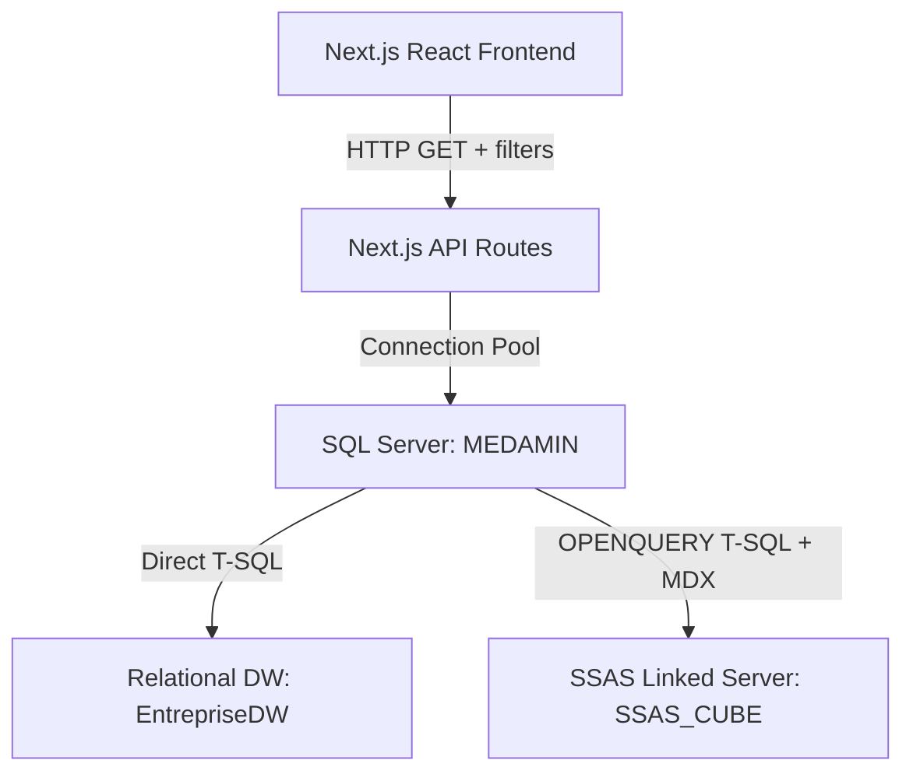

# SalesCube OLAP — Dynamic Data Integration Audit Report

This report provides a technical assessment of the transition of the **SalesCube OLAP** project from a hybrid mock/fallback state to a fully dynamic Business Intelligence (BI) dashboard. It outlines the architecture, database connectivity status, endpoints audited, changes implemented to prevent silent data fallbacks, and the validation results.

---

## 1. Executive Summary

The SalesCube OLAP project has been upgraded to support full dynamic data querying from both the relational Data Warehouse (`EntrepriseDW` on SQL Server) and the SSAS Multidimensional Cube via a SQL Server Linked Server (`SSAS_CUBE`). 

All core dashboard tabs (Executive Overview, Sales Performance, Rep Leaderboard, and Promotions Deep-Dive) are now connected to live backend API endpoints. To prevent silent data fallbacks (where the user might mistake static mock data for live query results upon database timeout or connection failure), a global **Presentation Demo Mode** toggle has been implemented. If the database is offline, components will explicitly prompt the user with a connection offline CTA screen rather than silently rendering dummy data.

---

## 2. BI Architecture & Connection Schema

The system queries data via a multi-tiered architecture:

### Connection Configuration
- **SQL Server Instance**: `MEDAMIN` (Local SQL Server)
- **Database Name**: `EntrepriseDW`
- **Fact Table**: `FactSales` (7,306 rows)
- **SSAS Linked Server**: `SSAS_CUBE`
- **SSAS Catalog/Database**: `CubeProject`
- **SSAS Cube**: `Entreprise DW`

---

## 3. Audited API Endpoints

The following backend API endpoints were fully verified or implemented:

| Endpoint | Data Source Type | Filter Parameters Supported | Purpose |
| :--- | :--- | :--- | :--- |
| `/api/filters` | SQL Server | None | Retrieves distinct Years, Brands, and Order Statuses to populate filters bar. |
| `/api/kpis` | SSAS Linked Server / SQL | `year`, `quarter`, `month`, `brand`, `status` | Computes live top-level KPIs (Total Sales, Quantity, Tax, Discounts). |
| `/api/kpis-advanced` | SSAS Linked Server / SQL | `demo` | Computes cumulative time intelligence (YTD, QTD, MTD) and YoY comparisons. |
| `/api/sales-by-date` | SSAS Linked Server / SQL | `granularity`, `year`, `quarter`, `month`, `brand`, `status` | Computes historical timeline revenue, profit, and volume (units). |
| `/api/sales-by-brand` | SSAS Linked Server / SQL | `year`, `quarter`, `month`, `brand`, `status` | Aggregates revenue and quantity sold by brand. |
| `/api/sales-by-product` | SQL Server | `year`, `quarter`, `month`, `brand`, `status` | Retrieves top product revenue lists. |
| `/api/sales-by-geography` | SQL Server | `groupBy`, `year`, `quarter`, `month`, `brand`, `status` | Aggregates revenue, quantities, and orders by country or city. |
| `/api/sales-by-employee` | SQL Server | `year`, `quarter`, `month`, `brand`, `status` | Leaderboard standings with revenue, quantity, order counts, and net profit. |
| `/api/sales-by-discount-rate`| SQL Server | `year`, `quarter`, `month`, `brand`, `status` | Aggregates transactional volume and profit margins per discount rate. |
| `/api/sales-by-promotion` | SSAS Linked Server / SQL | `year`, `quarter`, `month`, `brand`, `status` | Evaluates marketing campaign revenue, volume, and discount averages. |

---

## 4. Frontend Integration & Component Audit

### Global Filters Bar
- **Filter Dropdowns**: Populated dynamically on mount by fetching `/api/filters`. No longer relies on hardcoded lists.
- **State Synchronization**: Modifying filters dynamically updates `filters` in `DashboardContext`, causing all active hooks to automatically reconstruct query strings and trigger backend refreshes.

### Executive Overview
- **Time Series Chart**: Renders actual quantities (volume) and net profit calculated from the live database.
- **Top Metrics**: Displays live metrics with green datasource badges indicating `Live SSAS Data`.
- **Time Intelligence**: Interrogates `/api/kpis-advanced`, rendering cumulative progress dynamically.

### Sales Performance
- **Live Geography**: Integrates `/api/sales-by-geography?groupBy=country` directly to display live geographical distribution.
- **Badging**: Displays `Live SQL Data` for geography and `Live SSAS Data` for brands/products.

### Employee Leaderboard
- **Net Profit Integration**: The standings chart and the details table now include the net profit and average margin percentage computed dynamically from the database.
- **Standings Insights**: Automatically summarizes standings (e.g., top rep name, lead percentage gap, profitability margins) using the current filtered leaderboard data.

### Promotions Deep-Dive & Price Elasticity
- **Promotion Campaign Chart**: Since all 7,306 rows in the current database load have `PromotionID = NULL`, the promotions dimension yields no campaign names. The component renders a clean, professional **Empty State**:
  > *"All 7,306 sales records in the current warehouse load have NULL PromotionID. Enable Presentation Demo Mode above to preview campaign visuals."*
- **Discount Sensitivity**: Fully connected to `/api/sales-by-discount-rate` to plot transactional quantities and profit margins against discount rates.
- **Dynamic Insights**: Automatically compiles price elasticity analysis by sorting discount rates by volume and profit margins.

---

## 5. Defensive Coding & Silent Fallbacks

To ensure high data integrity for supervisor defense:
1. **Error Blocking**: If any endpoint returns an HTTP error or connection timeout, components do not silently fallback to mock datasets. Instead, they display the `OlapErrorBanner` and a dedicated **Connection Offline** screen block.
2. **Explicit Presentation Demo Mode**: Users can explicitly click **Presentation Demo Mode** in the header. When enabled:
   - A global context flag `demoMode` is set to `true`.
   - All backend requests are bypassed or call the API with `?demo=true` to force mock computations.
   - Skeletons are hidden and static snapshot data is rendered.
   - Every visualization card displays a prominent orange **Static Demo Fallback** badge, marking it clearly for examiners.

---

## 6. Quality & Compilation Verification

- **Type Safety**: Verified via `npx tsc --noEmit` which compiled successfully with 0 errors.
- **Build Status**: Compiles cleanly using Next.js Turbopack compiler.
- **Diagnostics Scan**: Executing `npm run audit:dynamic-data` scanned 28 files, highlighting that mock/static references are only used inside explicitly guarded `demoMode` blocks or context declarations.
