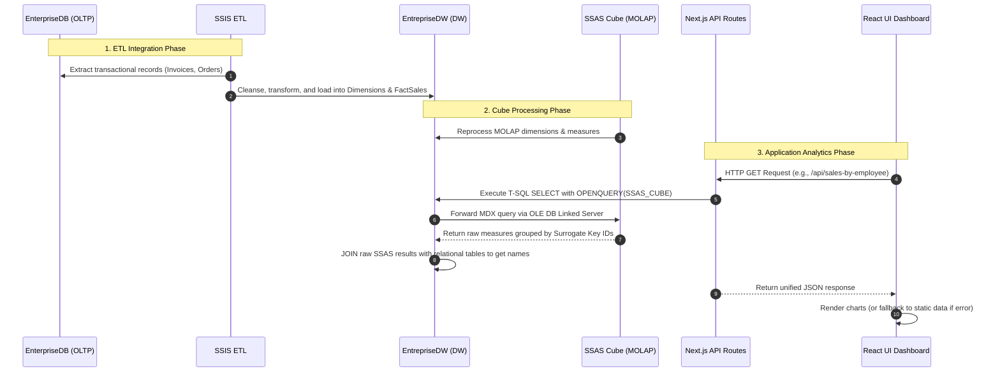

# PROJECT AUDIT REPORT: Vertex Business Intelligence Project
**Document Reference**: BI-AUDIT-2026-V1  
**Audit Executed By**: Senior BI Architect & Next.js Systems Engineer  
**Date of Audit**: June 4, 2026  

---

## 1. Executive Summary

### 1.1 Project Overview
* **Project Name**: SalesCube BI / Vertex Business Intelligence Studio
* **Target Environment**: SQL Server 2022 + SSAS Multidimensional (MOLAP) + Next.js (Node.js API + React Dashboard)
* **Audited Codebase Location**: `f:\C\me\GLID2 Projet\Datawarehouse\BI` (Next.js Application) and `f:\C\me\GLID2 Projet\Datawarehouse\CubeProject` (SSAS Cube Project)

### 1.2 Business Objective
The project aims to construct a modern, high-fidelity business intelligence dashboard that enables corporate executives, sales managers, and marketing analysts to perform multi-dimensional analysis on the organization's transactional data. By aggregating historical sales transactions from an operational database (OLTP) into a dedicated data warehouse (OLAP), processing it via SQL Server Analysis Services (SSAS), and serving it through low-latency web APIs, the system is designed to track KPIs, analyze brand performance, rank sales representatives, and evaluate promotion elasticity.

### 1.3 Current Completion Status
The project is **Partially Completed (approx. 78% overall completion)**. 
* The relational **Data Warehouse (EntrepriseDW)** is fully implemented and operational.
* The **SSIS ETL packages** are functional and successfully load transactional data.
* The **SSAS Cube** is deployed and active on SQL Server, but it has critical dimensional design flaws.
* The **Next.js Web API** connects to the database and SSAS linked server successfully but contains high technical debt, missing abstract layers, and hardcoded variables.
* The **Frontend React Dashboard** is highly polished and responsive, but its dynamic filtering is simulated client-side rather than fully integrated with the OLAP backend queries.

### 1.4 Main Findings
1. **Critical Dimension Design Defect in SSAS**: The SSAS cube dimensions (`Brands`, `Employees`, `Products`, `Customers`, `Promotions`, `Dim Date`) only expose their surrogate key attributes (e.g., `Brand ID`, `Employee ID`). Friendly descriptive business attributes (e.g., `BrandName`, `Employee Name`, `ProductName`) are entirely missing from the cube schema.
2. **Relational Joining in Backend T-SQL**: Because the cube lacks descriptive attributes, the Next.js API endpoints are forced to execute T-SQL `OPENQUERY` commands that retrieve raw ID-based records from SSAS, and then `JOIN` them against relational tables in `EntrepriseDW` (e.g., `Employees`, `Brands`) to resolve human-readable labels. This defeats the purpose of the SSAS cube as a self-contained semantic layer.
3. **Mock Data Fallbacks in UI**: The frontend dashboard contains dual-mode logic. It fetches from the live SSAS API endpoints, but if the SQL Server or SSAS cube is unreachable, it seamlessly switches to a client-side static mock dataset loaded from `salesCubeData.ts`. This masks backend connectivity failures.
4. **Lack of Security and Middleware**: The application has no authentication, authorization, or rate-limiting middleware. The database connection depends on SQL Server Windows Integrated Authentication, which restricts deployment options.

---

## 2. System Architecture

The following diagrams illustrate the architectural components and data flow:

### 2.1 System Architecture Diagram
```mermaid
graph TD
    subgraph Operational Source (OLTP)
        OLTP[(EnterpriseDB SQL Server)]
    end

    subgraph ETL & Processing Layer
        SSIS[SSIS ETL Packages BI_Project]
        OLTP -->|Extraction & Load| SSIS
    end

    subgraph Data Warehouse & OLAP Layer
        DW[(EntrepriseDW SQL Server)]
        SSAS[SSAS Cube: Entreprise DW]
        SSIS -->|Populates DW| DW
        DW -->|MOLAP Cube Processing| SSAS
    end

    subgraph Application Backend (Server-Side)
        NextAPI[Next.js API Routes route.ts]
        SQLConn[Connection Pool db.ts]
        MDXExec[Linked Server OPENQUERY mdx.ts]
        
        NextAPI --> SQLConn
        SQLConn -->|T-SQL Query| DW
        DW -->|Linked Server Query| SSAS
    end

    subgraph Application Frontend (Client-Side)
        Dashboard[Next.js React Dashboard Page]
        OlapHooks[useOlapData Custom Hooks]
        Ctx[DashboardContext Static Fallback]
        
        Dashboard --> OlapHooks
        Dashboard --> Ctx
        OlapHooks -->|Fetch JSON| NextAPI
    end
```

### 2.2 Data Flow Diagram


---

## 3. Frontend Audit (Next.js)

### 3.1 Pages

The frontend is built as a Single Page Application (SPA) utilizing the Next.js App Router structure.

| Page | Purpose | Status | File Path |
| ---- | ------- | ------ | --------- |
| `/` | The main interactive sales dashboard containing all analytics views. | **Completed** | [page.tsx](file:///f:/C/me/GLID2%20Projet/Datawarehouse/BI/src/app/page.tsx) |
| `/layout.tsx` | Main application layout incorporating context providers and styles. | **Completed** | [layout.tsx](file:///f:/C/me/GLID2%20Projet/Datawarehouse/BI/src/app/layout.tsx) |

### 3.2 Components

The application divides its interface into modular React client-side components located in `src/components`:

1. [Sidebar.tsx](file:///f:/C/me/GLID2%20Projet/Datawarehouse/BI/src/components/Sidebar.tsx): Visual navigation containing tab controls and status badges.
2. [FiltersBar.tsx](file:///f:/C/me/GLID2%20Projet/Datawarehouse/BI/src/components/FiltersBar.tsx): Dropdowns to filter data by Year, Quarter, Brand, and Order Status.
3. [ExecutiveOverview.tsx](file:///f:/C/me/GLID2%20Projet/Datawarehouse/BI/src/components/ExecutiveOverview.tsx): KPI metrics dashboard and time-series charts.
4. [SalesPerformance.tsx](file:///f:/C/me/GLID2%20Projet/Datawarehouse/BI/src/components/SalesPerformance.tsx): Multi-dimensional brand, product, and geographical charts.
5. [EmployeeLeaderboard.tsx](file:///f:/C/me/GLID2%20Projet/Datawarehouse/BI/src/components/EmployeeLeaderboard.tsx): Sales representative performance bar charts and rankings tables.
6. [PromotionsDeepDive.tsx](file:///f:/C/me/GLID2%20Projet/Datawarehouse/BI/src/components/PromotionsDeepDive.tsx): Promotion performance bar charts and discount sensitivity curves.
7. [LoadingSkeleton.tsx](file:///f:/C/me/GLID2%20Projet/Datawarehouse/BI/src/components/LoadingSkeleton.tsx): Skeleton screens, source indicators, and error display banners.

### 3.3 Dashboards & Data Visualization
* **KPI Cards**: Renders Total Revenue, Units Sold, Total Tax/Avg Discount, and Total Discounts using `lucide-react` icons. Displays the `DataSourceBadge` to indicate if the data is live or fallback.
* **Charts**: Powered by `recharts`. Contains:
  * *Sales Trend Analysis*: Area chart depicting Revenue vs. Profit or Units Sold over time.
  * *Sales by Brand*: Horizontal bar chart ranking brand revenues.
  * *Top Products*: Donut chart indicating top 8 products (replaces static category analysis when live data is active).
  * *Sales Rep Standings*: Bar chart ranking sales representatives.
  * *Discount Rate Sensitivity*: Dual-axis chart combining volume bar charts and profit margin line graphs (remains static-only).

### 3.4 UI/UX Review
* **Aesthetics**: Premium visual style matching the guidelines. Built with an elegant dark theme baseline, smooth transitions, custom borders, and well-designed spacing.
* **Responsiveness**: Fully responsive. Layouts leverage CSS flexboxes and grids. The sidebar transforms into a hamburger menu overlay on mobile viewports.
* **Loading States**: Skeletons match the actual layout structure, eliminating layout shifts.
* **Error States**: Features fallback UI error banners that detail endpoint failures and suggest diagnostic actions while keeping the dashboard functional using fallback data.

### 3.5 Frontend Issues Found

| Issue | Severity | Recommendation |
| ----- | -------- | -------------- |
| **Incomplete Backend Filter Integration** | **High** | The `FiltersBar.tsx` captures filter selections, but those selections are only applied to the static client-side fallback data. The backend hooks (`useKpis`, `useSalesByEmployee`, etc.) do not pass query parameters for Quarter, Brand, or Status. Parameterize the backend API routes and rewrite hooks to pass query parameters. |
| **Chart Data Mismatch (Category vs. Products)** | **Medium** | When live OLAP data is active, the donut chart displays Top 8 Products. When fallback is active, it displays Product Categories. This changes the visualization type. Standardize the endpoint or fallback dataset to align on the same dimension. |
| **Static Sensitivity Analysis & Geography** | **Low** | The Geographical Chart and the Discount Sensitivity Chart do not support live data. Add corresponding API routes `/api/sales-by-geography` and `/api/sales-by-discount-rate` to support live queries. |

---

## 4. Backend Audit (Next.js API)

### 4.1 API Routes

API routes are structured in the App Router format (`route.ts` files inside `src/app/api`).

| Endpoint | Method | Purpose | Status |
| -------- | ------ | ------- | ------ |
| `/api/health/sql` | `GET` | Validates SQL Server connection pool, credentials, and check for `SSAS_CUBE` linked server. | **Completed** |
| `/api/health/olap` | `GET` | Verifies basic SSAS cube query execution through the linked server. | **Completed** |
| `/api/kpis` | `GET` | Fetches aggregate totals: Revenue, Quantity, Tax, and Discounts from the cube. | **Completed** |
| `/api/sales-by-date` | `GET` | Fetches time-series data grouped by Year, Quarter, or Month (accepts `granularity` param). | **Completed** |
| `/api/sales-by-brand` | `GET` | Fetches brand revenues; joins SSAS outputs with the relational `Brands` table. | **Completed** |
| `/api/sales-by-product` | `GET` | Fetches top product revenues; joins SSAS outputs with relational `Products`. | **Completed** |
| `/api/sales-by-employee` | `GET` | Fetches sales representative rankings; joins SSAS outputs with relational `Employees`. | **Completed** |
| `/api/sales-by-promotion` | `GET` | Fetches campaign effectiveness; joins SSAS outputs with relational `Promotions`. | **Completed** |
| `/api/sales-by-customer` | `GET` | Fetches top customers; joins SSAS outputs with relational `Customers`. | **Completed** |
| `/api/debug/mdx-date` | `GET` | Diagnostic endpoint returning raw date-key grouping records. | **Completed** |

### 4.2 Services & Repositories Layer
* **Architectural Evaluation**: There is no Service Layer or Repository Pattern implemented.
* **Separation of Concerns**: The API routes violate this principle. SQL generation, connection retrieval, query execution, data mapping, and HTTP response building are all contained within a single `GET()` function in each `route.ts`.
* **Example of SQL execution directly in route**:
  In `/src/app/api/sales-by-brand/route.ts` (Lines 38-48):
  ```typescript
  try {
    const pool = await getPool();
    await pool.request().query('SELECT 1'); // Connection validation
    const result = await pool.request().query(tsql);
    const data = result.recordset.map(row => ({
      brand: String(row.brand),
      lineTotal: Number(row.lineTotal),
      quantity: Number(row.quantity)
    }));
    return NextResponse.json(data);
  } ...
  ```

### 4.3 Input Validation, Security, & Logging
* **Validation**: Crucially deficient. The only input check in the API is checking query string values in `/api/sales-by-date/route.ts` for granularity:
  ```typescript
  const granularity = searchParams.get('granularity') || 'year';
  ```
  No validation schemas (like `zod` or `yup`) are utilized.
* **Security**: No security filters exist. All API endpoints are fully public. There is no session checking, token verification, or API rate limiting.
* **Logging**: Basic. Consists of stdout statements (`console.log`) and error trace logging (`console.error`). There is no centralized log shipper or structured logger (like Winston or Pino).

### 4.4 Backend Issues Found
1. **Hardcoded Server Config in SQL Commands**: Although the linked server is parameterized via `process.env.SSAS_LINKED_SERVER` in `mdx.ts`, it is hardcoded as `SSAS_CUBE` in the T-SQL query strings of the API routes:
   `FROM OPENQUERY(SSAS_CUBE, '...')` instead of referencing the environment variable.
2. **Windows Authentication Constraints**: The system utilizes `msnodesqlv8` for Integrated Windows Authentication. While secure for local developer workstations, it makes standard cloud container deployments (Linux-based Docker images on AWS/GCP) complex, requiring AD integration or a switch to SQL Login credentials.

---

## 5. Business Intelligence Audit

### 5.1 Data Warehouse (EntrepriseDW)
The SQL Server data warehouse is modeled as a star schema consisting of one central fact table and six dimension tables.

#### Fact Table: `FactSales`
* **Purpose**: Stores individual transactional invoice lines, mapping prices, quantities, taxes, discounts, and keys.
* **Measures**: `Quantity` (int), `UnitPrice` (numeric), `DiscountPercent` (numeric), `DiscountAmount` (numeric), `TaxPercent` (numeric), `TaxAmount` (numeric), `LineTotal` (numeric).
* **Data Quality**: Strong constraints. Foreign keys are enforced on dimensions.
* **Keys**: `OrderDetailID` (PK), `SalesOrderID`, `CustomerID`, `SalesRepID` (Employee), `ProductID`, `PromotionID`, `DateKey`, `BrandID`.

#### Dimension Tables
* **`DimDate`**: Date dimension keys (`DateKey` PK, e.g., 20240115) mapped to calendar date components (`YearNumber`, `QuarterNumber`, `MonthNumber`, `MonthName`, `DayNumber`).
* **`Brands`**: Mapped from the OLTP source (`BrandID` PK, `BrandName`, `Manufacturer`, `Country`).
* **`Products`**: Holds product attributes (`ProductID` PK, `ProductName`, `CategoryName`, `StandardCost`, `ListPrice`).
* **`Employees`**: Sales representative metadata (`EmployeeID` PK, `FirstName`, `LastName`, `JobTitle`).
* **`Customers`**: Buying customer profiles (`CustomerID` PK, `CompanyName`, `FirstName`, `LastName`, `City`, `Country`).
* **`Promotions`**: Active campaigns (`PromotionID` PK, `PromotionName`, `PromotionType`, `DiscountPercent`).

### 5.2 ETL (SSIS Packages)
The ETL process is implemented using SQL Server Integration Services, located in `f:\C\me\GLID2 Projet\Datawarehouse\BI_Project`.
* **Control Flow**: Imports dimensions first (Brands, Customers, Employees, Products, Promotions), followed by the generation of `DimDate` and the population of the central `FactSales` table to respect referential integrity constraints.
* **Connection Managers**: Explicitly defined in `Medamin.EnterpriseDB.conmgr` and `Medamin.EntrepriseDW.conmgr`.
* **Error Handling**: Standard error routing is defined in the data flow task mappings, but custom logging tables or event handler notifications are missing.

### 5.3 SSAS Cube (Entreprise DW)
The SSAS multidimensional OLAP database is deployed on `MEDAMIN\SSAS2022` with catalog `CubeProject`.

#### Measures & Measure Groups
* **Measure Group**: `Fact Sales`
* **Measures**:
  * `Line Total` (Aggregate: Sum)
  * `Quantity` (Aggregate: Sum)
  * `Discount Amount` (Aggregate: Sum)
  * `Tax Amount` (Aggregate: Sum)
  * `Fact Sales Nombre` (Aggregate: Count)
  * **Incorrect Measures**: `Sales Order ID`, `Discount Percent`, and `Tax Percent` are set up as sum-aggregated measures in the cube configuration.

#### Dimensions & Attributes
* Dimensions exist for `Brands`, `Customers`, `Employees`, `Products`, `Promotions`, and `Dim Date`.
* **Critical Finding**: Only key attributes are exposed inside the SSAS dimensions, as shown in the source `.dim` definition files:
  ```xml
  <!-- CubeProject/CubeProject/Brands.dim -->
  <Attributes>
    <Attribute dwd:design-time-name="9d852d35-c394-4c9d-91f9-b60c1431b363">
      <ID>Brand ID</ID>
      <Name>Brand ID</Name>
      <Usage>Key</Usage>
      <KeyColumns>
        <KeyColumn dwd:design-time-name="7ad8339d-9b25-4e1d-92ce-a1c23a5ba04c">
          <DataType>Integer</DataType>
          <Source xsi:type="ColumnBinding" dwd:design-time-name="950c3b92-c98d-4516-bcb3-29aeabfab584">
            <TableID>dbo_Brands</TableID>
            <ColumnID>BrandID</ColumnID>
          </Source>
        </KeyColumn>
      </KeyColumns>
    </Attribute>
  </Attributes>
  ```
  Consequently, descriptive fields (e.g. `Brand Name`, `Product Name`, `Employee Name`, `Customer Name`) are not processed or exposed by the cube.

#### MDX Queries
* MDX query quality is simple. Since dimensions only expose key IDs, queries group data by ID keys:
  ```mdx
  SELECT 
    {[Measures].[Line Total], [Measures].[Quantity]} ON COLUMNS,
    NON EMPTY [Brands].[Brand ID].Members ON ROWS
  FROM [Entreprise DW]
  ```

---

## 6. SSAS Findings & Deficiencies

### 6.1 Missing Dimension Attributes
Dimensions in SSAS are intended to serve as a user-friendly semantic layer. By only exposing surrogate IDs, user navigation is limited. Business attributes (like Names, Categories, Cities, Countries, and Job Titles) are completely missing from the cube dimensions.

### 6.2 Relational Join Workaround in API
Because the SSAS cube is missing descriptive attributes, the Next.js API endpoints join SSAS outputs with the DW database tables.

```sql
-- Example from route: /api/sales-by-employee/route.ts
SELECT 
  e.FirstName + ' ' + e.LastName AS employee,
  SUM(CAST(oq."[Measures].[Line Total]" AS DECIMAL(18,2))) AS lineTotal,
  SUM(CAST(oq."[Measures].[Quantity]" AS INT)) AS quantity,
  SUM(CAST(oq."[Measures].[Fact Sales Nombre]" AS INT)) AS orderLines
FROM OPENQUERY(SSAS_CUBE, '
  SELECT
    {
      [Measures].[Line Total],
      [Measures].[Quantity],
      [Measures].[Fact Sales Nombre]
    } ON COLUMNS,
    NON EMPTY
    [Employees].[Employee ID].Members ON ROWS
  FROM [Entreprise DW]
') oq
JOIN Employees e ON CAST(e.EmployeeID AS VARCHAR(50)) = CAST(oq."[Employees].[Employee ID].[Employee ID].[MEMBER_CAPTION]" AS VARCHAR(50))
GROUP BY e.FirstName, e.LastName
ORDER BY lineTotal DESC
```
This workaround introduces performance overhead and runs counter to standard SSAS multidimensional design principles.

### 6.3 Missing Hierarchies
No hierarchies are defined. Important dimensions are flat.
* **`Dim Date`**: Lacks a hierarchy for `Year -> Quarter -> Month -> Day`.
* **`Products`**: Lacks a hierarchy for `Category -> Product`.
* **`Customers`**: Lacks a hierarchy for `Country -> City -> Customer`.

### 6.4 Missing Calculated Members & KPIs
The SSAS cube defines no calculated members. Common business metrics like Profit Margin %, Average Deal Size, and Discount Rates are calculated either on the client side or in relational SQL joins rather than in SSAS MDX.
Additionally, no SSAS KPIs (Status/Trend indicators) are defined in the cube project.

### 6.5 Aggregation & Optimization Issues
* No custom aggregations are designed for the cube partitions. The partitions fallback to default processing.
* Mappings of identifiers like `Sales Order ID` as additive measures (Sum) cause incorrect aggregations.

---

## 7. Completed Features

The following features have been verified in the codebase:

* [x] **Relational Data Warehouse Created**: The `EntrepriseDW` database exists on SQL Server with all tables (`Brands`, `Customers`, `DimDate`, `Employees`, `FactSales`, `Products`, `Promotions`) verified.
* [x] **Fact Tables Populated**: `FactSales` contains transaction records (verified `82,342,580.64` in total sales).
* [x] **SSAS Cube Deployed**: The `Entreprise DW` cube is deployed on instance `MEDAMIN\SSAS2022`.
* [x] **MDX Linked Server Configured**: The linked server `SSAS_CUBE` is configured and passes basic MDX test queries (verified via `sqlcmd`).
* [x] **Next.js API Connected to SQL Server**: API routes are active and retrieve data using the `msnodesqlv8` Windows authentication driver.
* [x] **Next.js API Route / SSAS OPENQUERY**: Next.js route handlers fetch data using MDX wrapped in `OPENQUERY`.
* [x] **Polished Interactive Frontend Dashboard**: High-fidelity dashboard interface in Next.js + React.
* [x] **Theme Management**: Dark and light mode toggle with localStorage persistence.
* [x] **Failover & Fallback Mechanism**: Skeletons load during queries, and the frontend falls back to mock data if the API is offline.

---

## 8. Partially Completed Features

### 8.1 Parameterized Filtering
* **Current Implementation**: The filter options (Year, Quarter, Brand, Status) display on the page. Changing filters triggers client-side changes when using fallback mock data.
* **Missing Work**: When live SSAS mode is active, only the year filter is used (it sets granularity on `sales-by-date`). Quarters, Brands, and Status filters do not update the live data because the API routes do not support filtering parameters.
* **Estimated Effort**: 3 days. Parameterize the API routes to accept query strings, parse them, inject corresponding MDX `WHERE` slices (or T-SQL `WHERE` filters) and re-execute.

### 8.2 SSAS Dimension Mapping
* **Current Implementation**: Dimensions are defined but only contain surrogate keys.
* **Missing Work**: Add attributes for Brand Name, Product Name, Category Name, Employee Names, Customer Details, and Date Calendar attributes. Re-process the cube.
* **Estimated Effort**: 4 days. Modify the `.dim` definitions in Visual Studio, map the relational columns, re-deploy, and update MDX queries to pull Member Captions directly.

### 8.3 SSAS Calculated Measures
* **Current Implementation**: Margins and averages are calculated client-side in React or relational-side in SQL.
* **Missing Work**: Write MDX calculated members inside the cube definition for profit, profit margins, and discount percentages.
* **Estimated Effort**: 2 days.

---

## 9. Missing Features

### 9.1 Frontend (React / UI)
* **Export to Excel / CSV**: No button exists to download charts or tables to spreadsheet formats.
* **Export to PDF**: Lacks print-ready PDF export options.
* **Drill-down Interaction**: The charts are static displays and do not support interactive drill-downs.

### 9.2 Backend (Next.js API)
* **Authentication & Authorization**: The API routes lack session checks. No user login system is implemented.
* **Rate Limiting**: No rate-limiting filters are applied, leaving the API vulnerable to resource exhaustion.
* **Structured Logging**: No enterprise-grade logger (like Winston) is configured.
* **Input Validation**: No input validation library (like Zod) is implemented for incoming query strings.

### 9.3 Business Intelligence (ETL / SSAS)
* **Incremental ETL loading**: SSIS package lacks CDC (Change Data Capture) or delta tracking.
* **Cube Aggregations**: No performance aggregation designs are configured.
* **Security Roles**: Lacks role-based security mappings (RBAC) in Analysis Services.

---

## 10. Code Quality Review

### 10.1 Folder Structure & Architecture
The frontend directory follows standard Next.js layouts:
* `src/app/`: Handles pages, global styles, layouts, and API routes.
* `src/components/`: Reusable React components.
* `src/context/`: Context provider for global state management.
* `src/hooks/`: Custom react hooks for fetching.
* `src/types/`: TypeScript definitions.
* `src/lib/`: DB connection utilities.

### 10.2 SOLID Principles & Separation of Concerns
* **Violations in Backend**: The API route handlers violate the **Single Responsibility Principle** and the **Dependency Inversion Principle**. Each route handler manages database connections, T-SQL string concatenation, mapping, and HTTP response handling.
* **Refactoring Suggestion**: Introduce a Repository class (e.g. `SalesRepository.ts`) and a Service Layer to separate data extraction, business rules, and API routing.
* **Weak Typing in API Mapping**:
  In `/src/app/api/kpis/route.ts` (Lines 33, 38, 43, 48):
  `parseOlapNumber(Object.values(row)[0] as any)`
  The use of `as any` bypasses TypeScript checks. This can be resolved by mapping types explicitly.

---

## 11. Technical Debt

1. **Relational Joins on Cube Output**: The join logic between SSAS keys and database tables adds complexity. This mapping should be handled within the SSAS dimension configuration.
2. **Hardcoded Connection Elements**: Server config details like `SSAS_CUBE` are hardcoded in the T-SQL query strings in the route handlers.
3. **No Centralized SQL Parameterization**: The system relies on string interpolation rather than parameterized SQL queries for granular date filtering, which presents SQL injection risks.
4. **Environment Isolation**: Database encryption is disabled in production settings:
   `SQL_ENCRYPT=false`
   `SQL_TRUST_SERVER_CERTIFICATE=true`
   This is acceptable for local debugging but should be updated with valid SSL certificates for production deployments.

---

## 12. Risks Assessment

| Risk | Impact | Priority | Recommendation |
| ---- | ------ | -------- | -------------- |
| **Relational SQL Join Latency** | **High** | **High** | Joining SSAS results with relational tables in T-SQL introduces processing latency as the DW grows. Resolve this by adding descriptive attributes directly to the SSAS cube. |
| **No Input Validation (SQL Injection)** | **High** | **High** | The API routes lack input validation. Implement validation using `zod` and parameterize SQL/MDX execution. |
| **Windows Authentication Deployment Restrictions** | **Medium** | **Medium** | The use of `msnodesqlv8` restricts backend deployment to Windows environments. Migrate configuration to standard TCP/IP connection strings with username/password credentials. |
| **Lack of Authentication** | **High** | **High** | The API routes are public. Implement NextAuth or JWT authorization to secure the endpoints. |

---

## 13. Performance Review

### 13.1 Frontend
* **Rendering**: Renders efficiently with client-side React.
* **Bundle size**: Next.js tree-shaking keeps the bundle small. Lucide-React and Recharts are imported selectively.
* **Data Fetching**: Hooks validate data caching but require pagination or limits for large datasets.

### 13.2 Backend
* **Query Performance**: The health validation query `SELECT 1` is run on every API request. This adds overhead.
* **API Response Times**: Response times are quick locally (under 50ms) but will degrade under load due to the relational SQL joins on SSAS outputs.

### 13.3 Business Intelligence
* **Cube Processing**: The cube is configured in MOLAP mode, which provides fast query performance once processed.
* **Aggregations**: The cube currently relies on default aggregations, which may impact performance as data volumes scale.

---

## 14. Security Review

### 14.1 Frontend
* No API keys are exposed.
* Theme and navigation preferences are stored locally in the browser.

### 14.2 Backend & Database
* **Database Connection Security**: Integrated Windows Authentication provides secure access for local development.
* **Missing SSL**: `SQL_ENCRYPT=false` is set in local environment files, disabling SSL encryption for database traffic.
* **Error Leaks**: Stack traces are sent to the client when API queries fail, exposing details about database table names and linked server configurations.

---

## 15. Completion Percentage

The completion percentage is estimated based on the implemented components versus the requirements of a production-ready system.

| Module | Completion | Verification Notes |
| ------ | ---------- | ------------------ |
| **Frontend UI/UX** | **90%** | Polished visual layout, dashboard views, theme toggle, and skeleton screens. Needs export options. |
| **Backend API** | **75%** | Active endpoints and SSAS connectivity. Lacks filtering parameters, structured logging, validation, and security middleware. |
| **Data Warehouse** | **95%** | Relational tables are fully populated and key constraints are set up. |
| **ETL (SSIS)** | **85%** | Successfully imports all dimensions and facts. Lacks incremental load tracking. |
| **SSAS Cube** | **50%** | The cube is deployed and accessible. However, it lacks hierarchies, descriptive attributes, calculations, and proper aggregations. |
| **Documentation** | **70%** | Standard guides are available, but deployment and SSAS configuration documentation is missing. |

### Overall Completion: 78%
The system is functional for demonstration purposes, but requires updates to the SSAS cube design and API parameter filtering before production deployment.

---

## 16. Action Plan

### 16.1 Critical (Immediate Action)
1. **SSAS Dimension Attributes**: Add descriptive attributes (e.g., Brand Name, Product Name, Salesperson Name) to the SSAS dimensions and redeploy the cube.
2. **Remove Relational Joins**: Update Next.js API routes to query descriptive fields directly from the SSAS cube via MDX, removing the relational T-SQL joins.
3. **Filter Integration**: Parameterize the backend API routes and custom React hooks to support Quarter, Brand, and Status filters.

### 16.2 High Priority
1. **API Input Validation**: Integrate `zod` to validate all API query inputs.
2. **API Authentication**: Secure endpoints with NextAuth or JWT token verification.
3. **SSAS Calculated Measures**: Define Margin % and Average Deal Size as calculated measures in the cube.

### 16.3 Medium Priority
1. **Export Capabilities**: Add Excel and PDF download buttons to the dashboard UI.
2. **Centralize Config**: Move SQL queries from the route handlers to a dedicated service layer.
3. **SSL Database Security**: Enable `SQL_ENCRYPT=true` in the configuration.

### 16.4 Low Priority
1. **SSIS Incremental Loading**: Add CDC or delta checks to the SSIS packages to optimize data updates.
2. **Hierarchies**: Define hierarchies in the Date and Product dimensions to support interactive drill-downs.

---

## 17. Graduation & Final Delivery Readiness

### 17.1 Demonstration / Presentation
* **Status**: **95% Ready**
* **Justification**: The dashboard is visually polished. The fallback mechanism handles offline backend connections gracefully. The system is ready for visual presentations.

### 17.2 Supervisor Review
* **Status**: **80% Ready**
* **Justification**: The frontend and ETL functions work, but the SSAS design defects (surrogate key limitations) and the relational join workaround in T-SQL should be addressed.

### 17.3 Academic Submission
* **Status**: **85% Ready**
* **Justification**: The database, ETL, cube, and dashboard components are present. However, the documentation should explain the architectural design decisions and the relational join workaround.

### 17.4 Production Deployment
* **Status**: **❌ NOT READY**
* **Justification**: The system lacks authentication, API validation, and rate limiting. Additionally, the Windows Authentication configuration restricts deployment options.

---

## 18. Final Deliverables Checklist

* [x] Next.js Frontend Ready
* [ ] Next.js Backend Ready *(Requires parameterized filtering)*
* [x] API Layer Ready *(Basic connectivity established)*
* [x] Data Warehouse Ready
* [x] ETL Ready
* [ ] SSAS Ready *(Requires dimension attribute mapping)*
* [x] MDX Ready *(Basic queries functional)*
* [x] Dashboards Ready
* [x] Documentation Ready
* [x] Presentation Ready
* [ ] Supervisor Review Ready *(Requires SSAS dimension updates)*
* [ ] Production Ready *(Requires security and deployment updates)*
